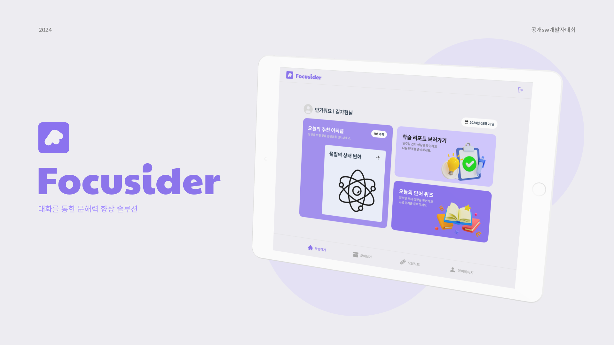
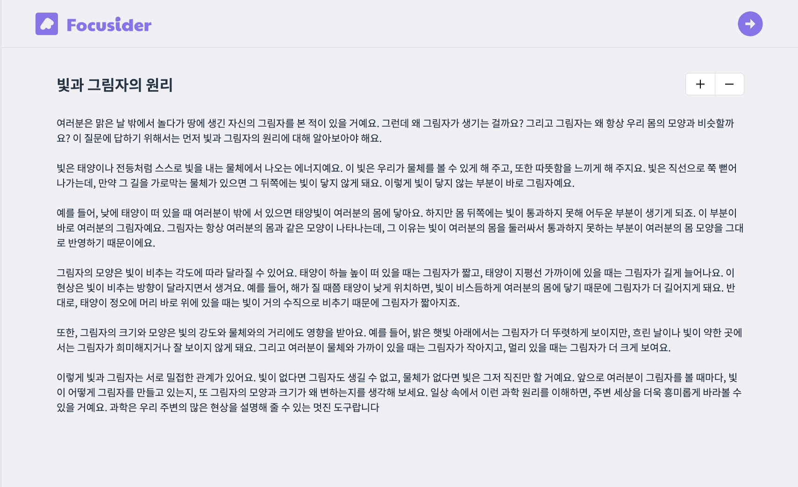
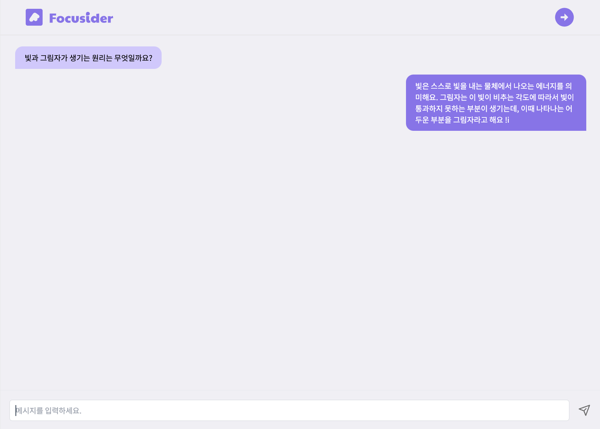
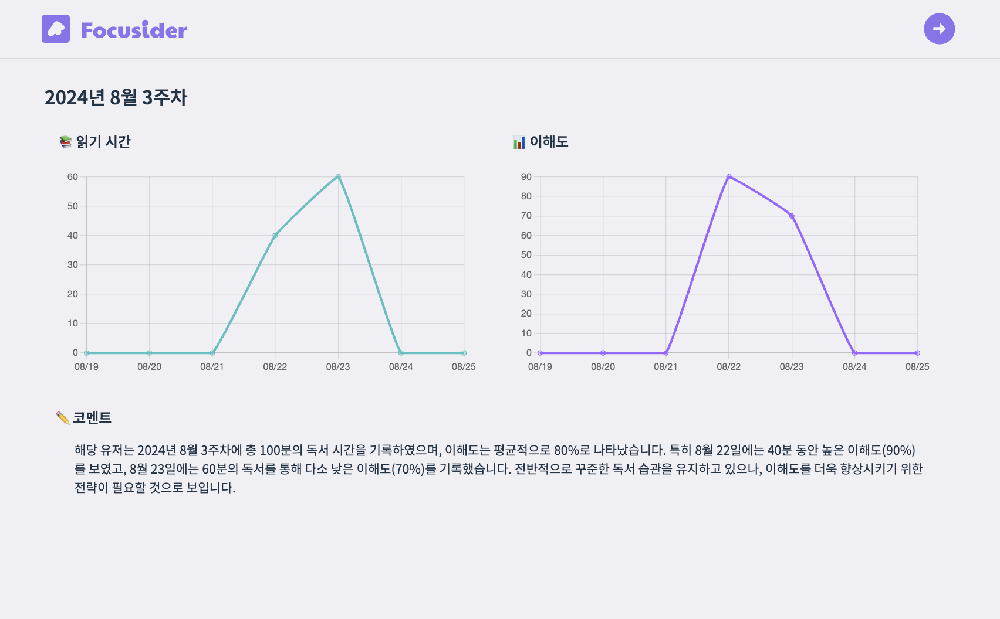
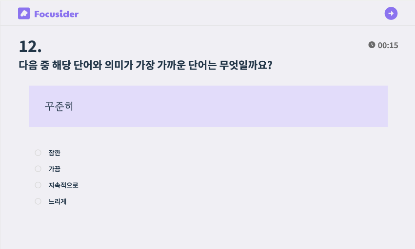
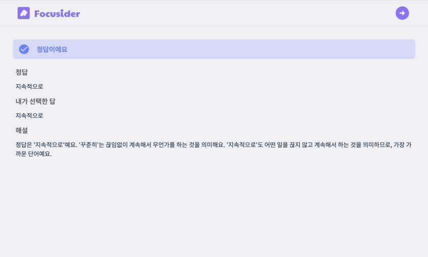

# 💬 대화를 통한 문해력 향상 솔루션, Focusider

<div align="center">
  
</div>

<br />

## 🗣️ 프로젝트 개요

초등학생들의 문해력 저하가 사회적 문제로 부각되면서, 학업 전반에서 어려움을 겪는 아이들이 늘어나고 있습니다.
이러한 배경을 바탕으로, 초등학생들의 문해력과 이해력을 체계적으로 개선하기 위한 맞춤형 학습 서비스를
기획하게 되었습니다.
이 서비스는 매일 제공되는 맞춤형 아티클을 읽고, 챗봇과의 상호작용을 통해 이해도를 점검할 수 있으며, 어려운 단어와 문맥에 대한 피드백을 받아 학습 능력을 자연스럽게 향상시킬 수 있도록 돕습니다.


<br />

## 🏃🏻 실행 방법

### 사전 준비물

- pnpm
- nodejs 20.16
- android studio

### 테스트 환경

- Galaxy Tab S8 (android 14)

### 실제 테스트 과정

1. git clone 및 패키지 설치

    ```bash
    git clone https://github.com/gcuswmono/Focusider-FE
    cd Focusider-FE
    pnpm install
    npm run build
    ```

2. capacitor로 android 설정 및 열기

    ```bash
    # 만약 android 폴더가 없다면
    pnpm cap add android
    pnpm cap sync android
    pnpm cap open android

    # 만약 ios에서 테스트 하고 싶다면
    pnpm cap add ios
    pnpm cap sync ios
    pnpm cap open ios
    ```

3. android studio에서 apk로 추출하고 싶다면,

   `Android Studio` - `Build` - `Build Bundle(s) / APK(s)` - `Build APK(s)`

<br />

## ⚙️ 기술 스택

<table>
    <thead>
        <tr>
            <th>분류</th>
            <th>기술 스택</th>
        </tr>
    </thead>
    <tbody>
        <tr>
            <td>
                  <p>프론트엔드</p>
            </td>
            <td>
                  
                  
                  
                  
                  
                  
                  
                  


</td>
        </tr>
        <tr>
            <td>
                <p>협업</p>
            </td>
            <td>
                
                
                
                


</table>

<br />

## 👩🏻‍💻 FE 팀원 소개

<table>
  <tr>
    <td align="center" width="150px">
      <a href="https://github.com/maylh" target="_blank">
        
      </a>
    </td>
<td align="center" width="150px">
      <a href="https://github.com/mango0422" target="_blank">
        
      </a>
    </td>

  </tr>
  <tr>
    <td align="center">
      <a href="https://github.com/maylh" target="_blank">
        김가현
      </a>
    </td>
    <td align="center">
      <a href="https://github.com/mango0422" target="_blank">
        서용준
      </a>
    </td>
  </tr>
</table>

<br />

## 🚀 핵심 기능

<h3> 오늘의 추천 아티클 </h3>

<table>
  <tr>
    <th>아티클</th>
    <th>채팅</th>
  </tr>
  <tr>
    <td></td>
    <td>
    </td>
  </tr>
</table>

- 회원가입 시 답변한 정보를 바탕으로 하루에 하나씩 추천 아티클 제공
- 사용자는 아티클을 읽고, 챗봇과 대화를 나누며 서로 상호작용함

<br />

<h3> 학습 레포트 </h3>

<table>
  <tr>
    <th>학습 레포트 상세보기</th>
  </tr>
  <tr>
    <td></td>
  </tr>
</table>

- 학습 시간 및 이해도를 그래프 형태로 제공
- 생성형 AI (GPT-4 mini)가 평가한 코멘트 제공

<br />

<h3> 오늘의 단어 퀴즈 </h3>

<table>
  <tr>
    <th>퀴즈 화면</th>
    <th>퀴즈 정답 화면</th>
  </tr>
  <tr>
    <td></td>
    <td></td>
  </tr>
</table>

- 5가지 카테고리(어휘력, 속담, 사자성어, 단어와 표현, 문법)에서 매일 3문제 제공
- 정답과 해설 제공


### 패키지 구조

```
├── README.md
├── android
├── capacitor.config.ts
├── docker-compose.yml
├── dockerfile
├── next.config.mjs
├── package-lock.json
├── package.json
├── pnpm-lock.yaml
├── postcss.config.mjs
├── public
│   └── images
├── src
│   ├── app
│   │   ├── (route)
│   │   │   ├── (with-layout)
│   │   │   │   ├── archive
│   │   │   │   ├── article
│   │   │   │   ├── home
│   │   │   │   ├── mypage
│   │   │   │   ├── quiz
│   │   │   │   ├── report
│   │   │   │   └── review
│   │   │   └── (without-layout)
│   │   │       └── signup
│   │   ├── _api
│   │   │   ├── archive
│   │   │   ├── article
│   │   │   ├── auth
│   │   │   ├── member
│   │   │   ├── quiz
│   │   │   ├── report
│   │   │   └── types.ts
│   │   ├── _assets
│   │   │   ├── icons
│   │   │   └── images
│   │   ├── _components
│   │   │   ├── article
│   │   │   ├── common
│   │   │   │   ├── atoms
│   │   │   │   ├── containers
│   │   │   │   └── modules
│   │   │   ├── layout
│   │   │   ├── login
│   │   │   ├── quiz
│   │   │   └── signup
│   │   ├── _types
│   │   ├── favicon.ico
│   │   ├── globals.css
│   │   ├── layout.tsx
│   │   └── page.tsx
│   └── type
├── tailwind.config.ts
└── tsconfig.json

```